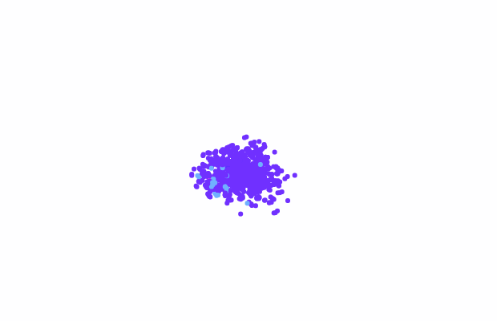
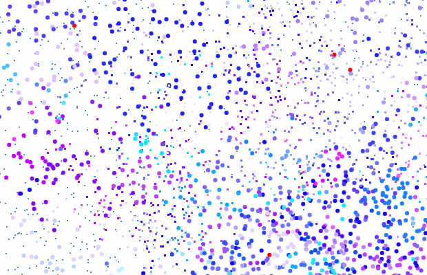

# ALifeGameJam2019

This is an artificial life ecosystem created at ALife Game Jam 2019.

https://mitsuyoshi-yamazaki.github.io/ALifeGameJam2019

## Gallery





## Run Locally

```shell
# Clone the repository
$ git@github.com:mitsuyoshi-yamazaki/ALifeGameJam2019.git

$ cd ALifeGameJam2019

# Install dependencies
$ yarn install

# Compile & build sources
$ yarn build

# Open Google Chrome with disabling security function (to load local js files)
$ open /Applications/Google\ Chrome.app/ --args --disable-web-security --user-data-dir

# Open `index.html` on Google Chrome
```


## Parameters

Parameters for `main.html`

- `art_mode`
  - 1(enable) or 0(disable)
  - Enables drawing mode
- `population_size`
  - number(1\~)
  - Initial population size
- `single_gene`
  - 1(enable) or 0(disable)
  - Starts with only one species
- `mutation_rate`
  - number(0\~1), 0.001\~0.03 recommended
  - The mutation rate when they reproduce
- `field_size`
  - number(1\~), around 1000 recommended
  - The simulation field size
- `screenshot_interval`
  - number(1\~), 200 recommended
  - The interval between taking screenshots
  - Disables screenshot by removing this parameter
- [Experimental] `mode`
  - string. Options are either "default", "linear", "torus", "circum" or "rotate"
  - Changes the simulation algorithm

